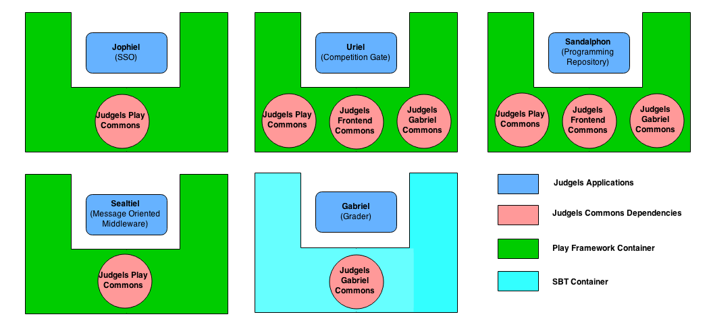
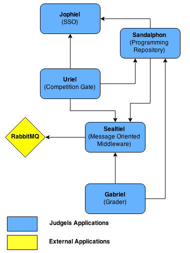

Developer's Guide
*****************

To start contributing to judgels development, you can view the project hosted on `github <https://github.com/ia-toki/judgels>`_. We put the issues of all judgels applications in that repository.

You can help by submit a new issue if you found one or fix a opened issue. In order to fix the issue, you can read below for to learn of our "teachings" of judgels development.

We develop judgels using `Play Framework 2.3.8 <http://www.playframework.com/>`_, `SBT <http://www.scala-sbt.org/>`_, and `IntelliJ IDEA 14 <https://www.jetbrains.com/idea/>`_. Since, we develop many judgels application, we create the commons that can be reused within many applications.

The commons are:

- Judgels Play Commons

  Judgels Play Commons consists of classes related to base layout rendering of views, less css, and javascripts. Judgels projects that use Judgels Play Commons can have the similar look and feel with every Judgels Application. The look and feel can be customized in each Judgels projects.

  Below are the images of two applications with similar look and feel using Judgels Play Commons.

  .. image:: _static/jophiel-look-and-feel.png
    :width: 45%

  .. image:: _static/uriel-look-and-feel.png
    :width: 45%

- Judgels Gabriel Commons

  Judgels Gabriel Commons consists of classes that contains implementation of grading engines. This commons is created to separate the grading engines from Gabriel. For Gabriel, grading engines only act as the implementation and Gabriel doesn't need to know about the detail.

  Judgels Gabriel Commons is also used in Judgels applications to list all available grading engines and construct grading messages that is supported by Gabriel.

- Judgels Frontend Commons

  Judgels Frontend Commons consists of classes that helps Judgels applications to connect to each others. Some of the classes are to provide problem rendering for Sandalphon's clients, single sign on for Jophiel's clients, etc.

  Judgels Frontend Commons also depends on Judgels Play Commons for layout and Judgels Gabriel Commons to provide base submission polling class. The dependency of Judgels Frontend Commons can be seen in image below.

  .. image:: _static/commons-dependencies.png
    :align: center

To use commons, Judgels applications directory must be on the same level as the commons directory. The build dependencies for all Judgels applications are shown in the image below.

Besides commons, Judgels applications are also connected to each other. The dependencies for Judgels applications:

- Jophiel

  Jophiel doesn't have any dependencies to any Judgels applications as shown in the image below. Jophiel can be run and provide single sign on service independently.

  .. image:: _static/jophiel-runtime-dependencies.png
    :align: center

- Sandalphon

  Sandalphon has dependencies to Jophiel for authentication and authorization and to Sealtiel for sending grading message to Gabriel.

  .. image:: _static/sandalphon-runtime-dependencies.png
    :align: center

- Uriel

  Uriel has dependencies to Jophiel for authentication and authorization, to Sandalphon for rendering problems, and to Sealtiel for sending grading message to Gabriel.

  .. image:: _static/uriel-runtime-dependencies.png
    :align: center

- Sealtiel

  Sealtiel has dependencies to RabbitMQ for storing messages inside queues.

  .. image:: _static/sealtiel-runtime-dependencies.png
    :align: center

- Gabriel

  Gabriel has dependencies to Sealtiel for polling grading requests and to Sandalphon to get problem evaluator data.

  .. image:: _static/gabriel-runtime-dependencies.png
    :align: center

All Judgels applications dependencies can be shown in the image below.

In Judgels web applications, we use Model View Controller (MVC) architectural pattern (the same pattern with Play Framework default). We use `MySQl <http://www.mysql.com/>`_ and `Hibernate ORM <http://hibernate.org/orm/>`_ for the databases.

We add some improvement to the pattern by using `Services <http://en.wikipedia.org/wiki/Service_layers_pattern>`_ and `Data Access Objects <http://en.wikipedia.org/wiki/Data_access_object>`_. By using those patterns, we can inject dependencies to create mock objects for testing purposes in the future.

Below are the image showing the flow of Judgels web applications.

.. image:: _static/judgels-web-flow.png
    :align: center

The explanation of elements are:

- Global

  Global is the `Global Object <https://www.playframework.com/documentation/2.3.x/JavaGlobal>`_ in Play Framework. It has some methods that can be overriden to handle requests.

  We use Global to construct DAOs, services, and controllers. By default, controllers in Play Framework are class with static methods. Controllers are designed to be stateless by that way. We change to construct it for dependency injection purposes.

- Controller

  Controller is the entry point of HTTP Request. HTTP Request trigger controller method call. We design controller to only check user permission and execute services. Controller can get business models from services as internal data for controller usage.

- Service

  Service is the layer that does all business logic of the system. Controller can call service to do some stuff and get business models. Service can call DAOs to do operation to databases or to get data models. By using services, we can create mock objects to do dependency injection for testing purposes.

- Data Access Object

  Data Access Object is an object that provides interface to do query to databases. The implementation depends on the database technologies that we used (in this case MySQL and Hibernate). By using DAOs, we can create mock objects to do dependency injection for testing purposes.

- Data Model

  Data Model represent the data structure used in the database. Every object in data model represent a row and field in data model represent a column in our cases. We use `Java Persistence API <http://en.wikipedia.org/wiki/Java_Persistence_API>`_ annotations to annotate the constraints, table name, and other properties of the data model.

- Business Model

  Business Model represent the data structure that can be used by the controller. The data structure in business model doesn't have to be the same with data model. The main purpose of business model is to display data for users.

- View

  View is used to display information and to provide user way to interact with the system. We use Play Framework's default template engine which is `Scala Template <https://www.playframework.com/documentation/2.3.x/ScalaTemplates>`_.

- Application Start

  Application Start is an event when the application started for the first time. In Play Framework, this event can be triggered by starting the application.

- HTTP Request

  HTTP Request is triggered when user open a web page either from browser or any other method.

- HTTP Resposne

  HTTP Response is the web page or any other content that are returned by the web application after processing the HTTP Request.

