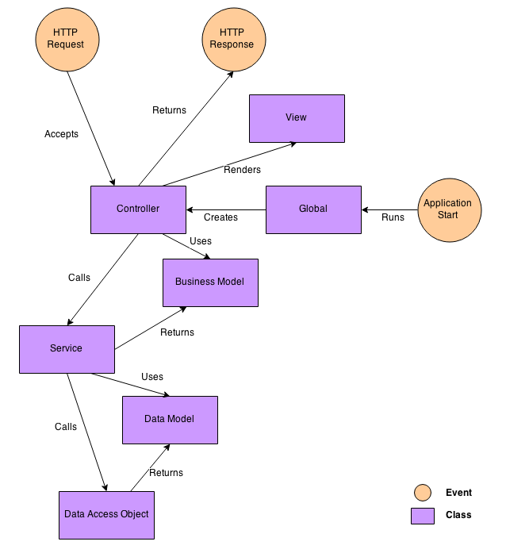

Basic concepts
==============

This section will explain the basic concepts of Judgels codebase.

Technology stack
----------------

Language
    - Java 8 for most code.
    - Scala for Play's views.

Framework
    `Play Framework 2.3.7 (Java) <https://www.playframework.com>`_ for Judgels Play applications.

Template engine
    `Twirl <https://www.playframework.com/documentation/2.3.x/ScalaTemplates>`_ for Judgels Play applications.

Database
    `MySQL <https://www.mysql.com>`_ for Judgels Play applications.

ORM
    `JPA (Java Persistence API) <http://en.wikipedia.org/wiki/Java_Persistence_API>`_ implemented with `Hibernate <http://hibernate.org/orm/>`_ for Judgels Play applications.

Build system
    `SBT <http://www.scala-sbt.org>`_, wrapped in `Typesafe Activator <https://www.typesafe.com/community/core-tools/activator-and-sbt>`_.

Sandbox
    `Moe Contest Environment <http://www.ucw.cz/moe/>`_ (the Isolate module) for Gabriel.

Project structure
-----------------

Judgels repositories are hosted on GitHub, in IA TOKI organization (https://github.com/ia-toki).

The main repository is the **judgels** repository. The responisibilites of this repository are:

- Hosting Judgels command-line tool, which will be used for installing Judgels applications.
- Hosting Judgels documentation.
- Being the central GitHub issue tracker for all Judgels applications.

The other Judgels repositories are prefixed with **judgels-**. For each Judgels application <app>, there will be a repository named **judgels-<app>**, which hosts the application code.

In addition, for each Judgels applications, there will be **judgels-<app>-commons** repository, which contains parts of the application that can be used by other applications that depend on it.

judgels-commons
    Consists of basic dependencies used by all applications.

judgels-play-commons
    Mainly consists of:

    - Base model components and their connection management with the database.
    - Base view components that are shared across all Judgels Play applications. For example: base look-and-feel layout.
    - Base controller components.

judgels-jophiel-commons
    Consists of components used by Jophiel clients for connecting to Jophiel.

judgels-sandalphon-commons
    Consists of components used by other Judgels applications for rendering problems and submitting solutions to Sandalphon.

judgels-uriel-commons
    Consists of components used by external applications for manipulating contest scoreboards. Currently it is not used yet by any applications other than Uriel.

judgels-sealtiel-commons
    Consists of components used by other Judgels applications for fetching and sending messages from Sealtiel.

judgels-jerahmeel-commons
    Consists of components used by other Judgels applications that depend on Jerahmeel (currently none).

judgels-michael-commons
    Consists of components used by other Judgels applications that depend on Michael (currently none).

judgels-gabriel-commons
    Consists of interfaces and implementations of grading engines.

Judgels Play application layers
-------------------------------

Judgels Play applications are built on top of Play framework. In Play framework, the MVC (Model-View-Controller) pattern is used. In Judgels, we use two other patterns: `Service <http://en.wikipedia.org/wiki/Service_layers_pattern>`_ and `DAO (Data access object) <http://en.wikipedia.org/wiki/Data_access_object>`_.

It will be easier to explain with a diagram. Suppose that a user wants to change his profile on Jophiel. Here is the flow of events that will happen in Jophiel, numbered from 1 through 11. For completeness, we will explain from the start of Jophiel. Each component will be explained along with the explanation of the events.

#. Admin starts Jophiel, using :code:`judgels start jophiel` or :code:`judgels run jophiel` command.

#. The Play's `Global <https://www.playframework.com/documentation/2.3.x/JavaGlobal>`_ object is loaded and run. It will construct all controller classes and their dependencies (services), using dependency injection with Spring Framework.

#. User makes HTTP request to change his profile, by opening the URL http://localhost:9001/profile on his browser.

#. The request is passed to the Play's `Routes <https://www.playframework.com/documentation/2.3.x/JavaRouting>`_ object. Based on the request string (**/profile**), the correct controller class and the action method is called. In this case, **UserProfileController**'s **profile()** method is called.

#. The controller checks whether the user has the right permission to perform the action. Then, controller calls the correct method in the service object responsible for user management. Services are objects that do business processes of the system. In this case, **UserProfileService**'s **updateProfile()** is called.

#. The service calls the DAO (Data Access Object) to retrieve the user data model from the database. DAO is an object that provides interface to do queries to the database, regardless of the database's SQL variants. We use Hibernate for wrapping the SQL queries. In this case, **UserDao**'s **findByJid()** is called. The user's JID is passed to the method.

#. The DAO finds the correct user record in the database, wraps it into a data model object, and return it. Data model is the Java class representation of a row in the database table. Fields in data model represent columns in the database table. We use `JPA (Java Persistence API) <http://en.wikipedia.org/wiki/Java_Persistence_API>`_ for describing the table and columns in Java. In this case, the user data model class is **UserModel**. We also use metamodels; see `Syntactically correct and type-safe JPA queries in Play 2.0 <http://blog.lunatech.com/2012/04/16/jpa-queries-playframework-20>`_ for more details.

#. The service retrieves the returned user data model, and wraps into a user business model object. This business model represent data structure that does not depend on database, and is used by controllers, views, and the other services. They do not care how the business model was constructed. In this case, the user business model class is **User**. Normally, the business model class is similar to its data model class counterpart. Then, the user business model object is returned by the service.

#. The controller retrieves the returned user business model. Then the controller uses the user's properties to construct the form object. In this case, the form class is **UserProfileForm**.

#. The controller passes the form to the view object to render. We use `Twirl <https://www.playframework.com/documentation/2.3.x/ScalaTemplates>`_, the default Play's templating engine. The whole view and form are rendered as HTML page.

#. The controller returns an HTTP response to the user. The user is then able to fill the form for changing his profile. The flow finishes.

Database design
---------------

Judgels adapts the database design explained here: `Phabricator Database Schema <https://secure.phabricator.com/book/phabcontrib/article/database/>`_. Some highlights:

- Each object in Judgels has a **JID** (Judgels ID) in the form of **JID-XXX-YYYYYYYYYYYYYYYYYYYY**, where X is object type code and Y is a shortened UUID.
- No foreign keys, since we want that objects can be transferred between Judgels applications. For example, we may want to create a set of Judgels instance for OSN, and then transfer the problems back to the central repository.
- Properties that are not to be queried and have complex structure, are stored either in harddisk or in database as JSON strings.

Additionally, each object has the following fields:

- userCreate, timeCreate, ipCreate: user, time, and IP when this object is created.
- userUpdate, timeUpdate, ipUpdate: user, time, and IP when this object is updated.
