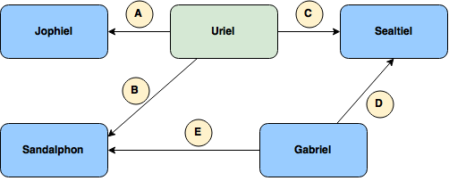

Dependencies
============

Uriel depends on other Judgels applications to run correctly. Here is the dependency diagram.

An arrow pointing from A to B means that A depends on B. The dependencies between applications are described as follows.

A. Uriel connects to Jophiel for user authentication and authorization.
B. Uriel connects to Sandalphon for fetching resources (problems/lessons).
C. Uriel connects to Sealtiel for sending grading requests and polling grading responses.
D. Gabriel connects to Sealtiel for polling grading requests and sending grading responses.
E. Gabriel connects to Sandalphon for fetching test cases.

Note that the Gabriel used for grading submissions from Uriel can be the same Gabriel used for grading submissions from Sandalphon.
